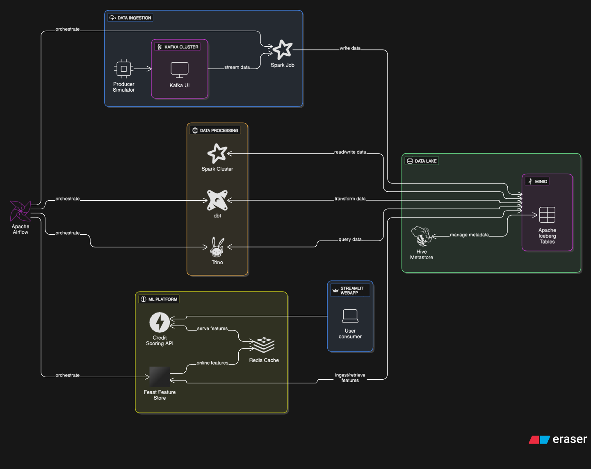

# Modern Data Pipeline para Agronegócio

> Um pipeline de dados moderno e de código aberto, demonstrando uma arquitetura completa para o agronegócio, desde a ingestão de dados em tempo real até a entrega de modelos de Machine Learning como uma API de scoring de crédito.

[](https://mepagaumcafe.com.br/matheushrd)


### ✨ Tecnologias Principais


---

## 🏗️ Arquitetura Detalhada

Esta arquitetura foi desenhada para ser uma plataforma de dados robusta, escalável e modular, totalmente baseada em tecnologias open-source. A filosofia é desacoplar os componentes, permitindo que cada ferramenta execute sua função especializada, desde a ingestão até a entrega de insights.

-   **Fundação (Data Lakehouse):** O núcleo da arquitetura é o **Data Lakehouse**, que combina a flexibilidade de um Data Lake com a confiabilidade de um Data Warehouse.
    -   **MinIO** atua como o storage de objetos, oferecendo uma camada de armazenamento escalável e compatível com S3.
    -   **Apache Iceberg** é o formato de tabela aberta que gerencia os dados no MinIO. Ele adiciona uma camada transacional (ACID), versionamento de dados (*time travel*), e evolução de schema, tratando os dados no lake como tabelas de banco de dados confiáveis.
    -   O **Hive Metastore** (com backend em MariaDB) centraliza todos os metadados (schemas, partições, etc.), permitindo que diferentes motores de processamento (Spark, Trino) acessem os mesmos dados de forma consistente.

-   **Fluxo de Dados (Pipeline):** O fluxo segue o padrão **Medallion (Bronze, Silver, Gold)**.
    -   **Ingestão (Real-time):** Dados são produzidos em formato **Avro** (definido em `producer_schema.avsc`), que garante um schema forte e compressão eficiente. O **Kafka** atua como um buffer, desacoplando os produtores dos consumidores e garantindo a entrega das mensagens.
    -   **Processamento e Transformação:**
        -   **Apache Spark** é usado para a ingestão inicial (streaming), lendo do Kafka e escrevendo na camada Bronze.
        -   **Trino** é o motor de consulta federado, otimizado para consultas analíticas de baixa latência diretamente no Data Lakehouse.
        -   **dbt** orquestra as transformações SQL via Trino. Ele transforma os dados brutos (Bronze) em dados limpos e enriquecidos (Silver) e, em seguida, em modelos de negócio agregados (Gold), prontos para análise e ML.

-   **Orquestração e MLOps:**
    -   **Apache Airflow** é o cérebro da operação, orquestrando todos os pipelines de forma agendada. Ele dispara os jobs do dbt e o pipeline de retreinamento de modelos de ML.
    -   **Feast** serve como uma **Feature Store**, criando uma ponte entre a engenharia de dados e a ciência de dados. Ele materializa features da camada Gold para um **Online Store (Redis)**, garantindo acesso de baixa latência para a API de inferência.
    -   A **API (FastAPI)** serve o modelo de ML e é o ponto de entrada para os consumidores finais. Ela é desacoplada do treinamento, apenas carregando o modelo mais recente.



## 🤖 Como Usar a API de Scoring

A API de scoring de crédito é o produto final deste pipeline. Para interagir com ela, você pode usar a interface do Streamlit ou fazer requisições diretas.

### Testando com o Script Automatizado

O projeto inclui um script de teste (`test_api.sh`) que simula diferentes cenários de requisição.

1.  **Navegue até o diretório do script:**
    ```bash
    cd services/credit_scoring_api/test_payloads/
    ```

2.  **Execute o script:**
    -   Para testar todos os cenários (aprovação, revisão manual e negação):
        ```bash
        ./test_api.sh
        ```
    -   Para testar um cenário específico, como o de aprovação:
        ```bash
        ./test_api.sh approve_case.json
        ```
    -   Para ver as informações do modelo atualmente em produção:
        ```bash
        ./test_api.sh --model-info
        ```

O script verifica a saúde da API, envia os payloads dos arquivos JSON, e exibe tanto a requisição quanto a resposta formatada, indicando o sucesso ou falha de cada caso.

## 🔍 O Pipeline em Detalhes

1.  **Ingestão (Real-Time - Camada Bronze):**
    -   O `producer-simulator` cria mensagens no formato **Avro**, que é binário, compacto e suporta evolução de schema, ideal para streaming de dados.
    -   Um job de **Spark Streaming** (`ingestion_to_iceberg.py`) consome continuamente do Kafka. Este é um processamento *real-time*.
    -   **Benefício:** Os dados chegam à camada **Bronze** (tabela Iceberg) com latência de segundos, preservando o dado bruto e original para futuras análises. O Iceberg garante que cada escrita seja uma transação atômica.

2.  **Transformação (NRT - Camada Silver):**
    -   Uma DAG do Airflow (`dbt_trino_silver_dag`) é executada em modo *Near Real-Time* (NRT), por exemplo, a cada 5 minutos.
    -   Ela executa os modelos do dbt que transformam os dados da camada Bronze. As transformações são **incrementais**, utilizando a estratégia `merge` do Iceberg.
    -   **Benefício:** Apenas os dados novos ou atualizados são processados, o que é extremamente eficiente. O dbt permite que essas transformações sejam modulares, testáveis e documentadas, garantindo a qualidade da camada **Silver**.

3.  **Agregação (Batch - Camada Gold):**
    -   Outra DAG (`dbt_trino_gold_dag`) é executada em modo *batch* (ex: a cada hora), pois agregações de negócio não exigem a mesma latência.
    -   Ela cria as tabelas da camada **Gold**, que contêm as *features* agregadas (ex: `proponente_features_agro`) prontas para serem consumidas por dashboards ou pelo pipeline de ML.
    -   **Benefício:** A camada Gold é a "fonte da verdade" para o negócio, com métricas e features pré-calculadas, otimizando as consultas finais.

4.  **Retreinamento Automático do Modelo (MLOps):**
    -   A DAG `ml_model_training_dag` representa um ciclo de MLOps automatizado.
    -   **Detecção de Drift:** Primeiro, ela verifica se houve *data drift*, comparando a distribuição dos dados atuais da camada Gold com uma janela histórica.
    -   **Retreinamento:** Se um drift significativo é detectado ou se o modelo agendado para retreino (ex: a cada 6 horas) é acionado, a DAG treina um novo modelo `RandomForestClassifier` com os dados mais recentes.
    -   **Avaliação e Deploy:** O novo modelo é avaliado contra o modelo anterior. Se a performance (ex: F1-score) for superior, o novo artefato (`credit_model.joblib`) é salvo no diretório compartilhado.
    -   **Restart da API:** Por fim, a DAG reinicia o contêiner da API para que ela carregue o novo modelo sem downtime.
    -   **Benefício:** O sistema se adapta automaticamente a mudanças no padrão dos dados, garantindo que o modelo em produção seja sempre o mais performático possível, sem intervenção manual.

## 📖 Tabelas do Pipeline de Dados

O pipeline de dados é estruturado seguindo a metodologia Medallion (Bronze, Silver, Gold), garantindo a qualidade e a governança dos dados em cada etapa.

### 🥉 Camada Bronze

A camada Bronze armazena os dados brutos, exatamente como chegam da fonte, com o mínimo de processamento.

-   **Tabela:** `bronze.dados_produtores_agro`
-   **Origem:** Job Spark `ingestion_to_iceberg.py`.
-   **Descrição:** Esta tabela Iceberg recebe os dados em streaming do tópico Kafka `dados_produtores`. Ela armazena os registros no formato original Avro, incluindo todas as estruturas aninhadas (`localizacao_propriedade`, `fontes_dados_adicionais`, `metadata_evento`). A tabela é particionada por mês (`ingestion_timestamp`) e `tipo_pessoa` para otimizar as consultas na camada seguinte. O objetivo é ter uma cópia fiel e imutável dos dados de origem.
-   **Schema:**
    ```sql
    proponente_id STRING,
    data_solicitacao LONG,
    cpf_cnpj STRING,
    nome_razao_social STRING,
    tipo_pessoa STRING,
    renda_bruta_anual_declarada DOUBLE,
    valor_solicitado_credito DOUBLE,
    finalidade_credito STRING,
    localizacao_propriedade STRUCT<latitude: DOUBLE, longitude: DOUBLE, municipio: STRING, uf: STRING>,
    area_total_hectares DOUBLE,
    cultura_principal STRING,
    possui_experiencia_atividade BOOLEAN,
    anos_experiencia INT,
    fontes_dados_adicionais STRUCT<serasa_score: INT, ibama_autuacoes_ativas: BOOLEAN, numero_matricula_imovel: STRING>,
    metadata_evento STRUCT<versao_schema: STRING, origem_dados: STRING, timestamp_geracao_evento: LONG>,
    ingestion_timestamp TIMESTAMP
    ```

### 🥈 Camada Silver

A camada Silver transforma os dados brutos em um formato mais limpo, validado e enriquecido, pronto para análise.

-   **Tabela:** `silver.silver_dados_produtores_agro_trino`
-   **Origem:** Modelo dbt `silver_dados_produtores_agro_trino.sql`.
-   **Descrição:** Este modelo dbt lê os dados da tabela Bronze, realiza as seguintes transformações e materializa o resultado de forma incremental:
    -   **Desaninhamento (Flattening):** Extrai campos de estruturas aninhadas (como `latitude` e `longitude`) para colunas de primeiro nível.
    -   **Type Casting:** Converte timestamps (de Unix milissegundos para o formato `TIMESTAMP WITH TIME ZONE`).
    -   **Limpeza:** Renomeia colunas para um padrão mais claro (ex: `latitude` para `localizacao_latitude`).
    -   **Enriquecimento:** Adiciona novas colunas de negócio, como:
        -   `classificacao_propriedade`: Classifica a propriedade em `MINIFUNDIO`, `PEQUENA`, `MEDIA` ou `GRANDE` com base na área.
        -   `faixa_risco_credito`: Define uma faixa de risco (`BAIXO`, `MEDIO`, `ALTO`) com base no `serasa_score`.
    -   **Validação:** Cria a coluna booleana `registro_valido` para sinalizar registros que atendem a critérios mínimos de qualidade.
-   **Schema (Principais Campos):**
    ```sql
    proponente_id STRING,
    data_solicitacao TIMESTAMP(6) WITH TIME ZONE,
    cpf_cnpj STRING,
    tipo_pessoa STRING,
    valor_solicitado_credito DOUBLE,
    finalidade_credito STRING,
    localizacao_latitude DOUBLE,
    localizacao_longitude DOUBLE,
    localizacao_municipio STRING,
    localizacao_uf STRING,
    area_total_hectares DOUBLE,
    cultura_principal STRING,
    anos_experiencia INT,
    serasa_score INT,
    ibama_autuacoes_ativas BOOLEAN,
    classificacao_propriedade STRING, -- Campo enriquecido
    faixa_risco_credito STRING,      -- Campo enriquecido
    registro_valido BOOLEAN,         -- Campo de validação
    processed_at TIMESTAMP(6) WITH TIME ZONE -- Timestamp do processamento
    ```

### 🥇 Camada Gold

A camada Gold contém dados agregados e focados em casos de uso de negócio específicos, como a criação de features para modelos de Machine Learning.

-   **Tabela 1:** `gold.proponente_features_agro`
    -   **Origem:** Modelo dbt `proponente_features_agro.sql`.
    -   **Descrição:** Agrega os dados da camada Silver para criar features centradas em cada `proponente_id`.
    -   **Schema (Principais Features):**
        ```sql
        proponente_id STRING,
        total_solicitacoes BIGINT,
        valor_medio_solicitado DOUBLE,
        serasa_score_medio DOUBLE,
        ultima_solicitacao TIMESTAMP(6) WITH TIME ZONE,
        dias_entre_primeira_ultima BIGINT,
        taxa_autuacoes_ibama DOUBLE,
        perfil_frequencia STRING, -- Ex: 'NOVO', 'RECORRENTE'
        perfil_volatilidade STRING, -- Ex: 'CONSISTENTE', 'VOLATIL'
        feature_timestamp TIMESTAMP(6) WITH TIME ZONE
        ```

-   **Tabela 2:** `gold.location_features_agro`
    -   **Origem:** Modelo dbt `location_features_agro.sql`.
    -   **Descrição:** Agrega os dados por localização (`UF` e `município`) para criar features que descrevem o comportamento do agronegócio em nível regional.
    -   **Schema (Principais Features):**
        ```sql
        localizacao_uf STRING,
        localizacao_municipio STRING,
        total_proponentes BIGINT,
        valor_medio_solicitado DOUBLE,
        area_media_hectares DOUBLE,
        cultura_dominante STRING,
        taxa_risco_elevado DOUBLE, -- % de solicitações com risco ALTO ou MUITO_ALTO
        densidade_proponentes STRING, -- Ex: 'BAIXA', 'ALTA'
        feature_timestamp TIMESTAMP(6) WITH TIME ZONE
        ```

-   **Tabela 3:** `gold.risk_features_agro`
    -   **Origem:** Modelo dbt `risk_features_agro.sql`.
    -   **Descrição:** Cria features agregadas por `faixa_risco_credito` e `cultura_principal` para análise de risco por segmento.
    -   **Schema (Principais Features):**
        ```sql
        faixa_risco_credito STRING,
        cultura_principal STRING,
        total_solicitacoes BIGINT,
        valor_mediano DOUBLE,
        serasa_score_medio DOUBLE,
        taxa_pessoa_juridica DOUBLE,
        score_risco_ajustado DOUBLE, -- Score de risco calculado
        volatilidade_credito STRING, -- Ex: 'HOMOGENEO', 'VOLATIL'
        feature_timestamp TIMESTAMP(6) WITH TIME ZONE
        ```

## ☁️ De Open Source para a Nuvem (AWS)

Este projeto foi construído com ferramentas open-source, o que é ideal para aprendizado e desenvolvimento local sem custos. No entanto, a arquitetura é diretamente traduzível para um ambiente de nuvem como a AWS, usando serviços gerenciados que oferecem escalabilidade, segurança e menor sobrecarga operacional.

Estudar e dominar esta stack open-source fornece uma base sólida para trabalhar com os seguintes serviços da AWS:

| Ferramenta Open-Source | Serviço Equivalente na AWS | Descrição da Similaridade |
| :--- | :--- | :--- |
| **Docker Compose** | **AWS Copilot / ECS / EKS** | Orquestração de contêineres para rodar os microsserviços. |
| **Apache Kafka** | **Amazon MSK** | Serviço gerenciado de streaming com Kafka. |
| **MinIO** | **Amazon S3** | Armazenamento de objetos para o Data Lake. |
| **Apache Spark** | **AWS Glue / Amazon EMR** | Processamento de dados serverless (Glue) ou em clusters gerenciados (EMR). |
| **Apache Iceberg** | **Apache Iceberg on Glue/EMR** | O formato de tabela é suportado nativamente nos serviços da AWS. |
| **Hive Metastore** | **AWS Glue Data Catalog** | Catálogo de metadados centralizado e serverless. |
| **Trino** | **Amazon Athena** | Serviço de consulta SQL serverless, baseado em Trino/Presto. |
| **dbt** | **dbt Cloud / dbt Core on EC2/ECS** | O dbt se conecta nativamente ao Redshift, Athena, etc. |
| **Apache Airflow** | **Amazon MWAA** | Serviço gerenciado de orquestração com Airflow. |
| **Feast + Redis** | **Amazon SageMaker Feature Store** | Feature store gerenciada para ML. |
| **FastAPI on Docker** | **AWS Lambda + API Gateway / SageMaker Endpoints** | Deploy de APIs serverless ou endpoints de ML gerenciados. |
| **PostgreSQL/MariaDB** | **Amazon RDS** | Banco de dados relacional gerenciado. |

**Vantagem de Aprender com Open Source:** Entender como cada peça (Kafka, Spark, Trino, etc.) funciona individualmente e se integra com as outras fornece um conhecimento profundo que é muitas vezes abstraído pelos serviços gerenciados da nuvem. Isso o torna um profissional mais completo, capaz de diagnosticar problemas, otimizar custos e escolher a ferramenta certa para cada trabalho, seja na nuvem ou on-premises.


## 🚀 Como Executar o Projeto

### Pré-requisitos

-   **Docker:** [Instruções de instalação](https://docs.docker.com/get-docker/)
-   **Docker Compose:** Geralmente incluído na instalação do Docker.
-   **Git:** Para clonar o repositório.
-   **Mínimo de 16GB de RAM** alocada para o Docker.
-   **SO Recomendado** Linux.
-   **Obs.:** Ao usar WSL nota-se a necessidade de mais memória RAM.

### Passos para a Instalação

1.  **Clone o repositório:**
    ```bash
    git clone https://github.com/matheushrd/modern-data-pipeline.git
    cd modern-data-pipeline
    ```

2.  **Inicie todos os serviços com Docker Compose:**
    Este comando irá baixar as imagens e iniciar os contêineres em segundo plano (`-d`).
    ```bash
    docker-compose up -d
    ```

3.  **Execute o script de setup:**
    Este script realiza configurações essenciais, como criar os tópicos no Kafka, os buckets no MinIO e inicializar as configurações do dbt e do Feast.
    ```bash
    ./setup.sh
    ```

### ✅ Verificando a Instalação

Após a execução do `setup.sh`, o pipeline começará a processar os dados. Você pode verificar o status:

-   **Airflow UI:** Acesse `http://localhost:8086` e verifique se as DAGs (`dbt_trino_silver_dag`, `ml_model_training_dag`, etc.) estão sendo executadas com sucesso.
-   **MinIO Console:** Acesse `http://localhost:9001` e verifique se os buckets (`bronze`, `silver`, `gold`) foram criados e contêm dados.
-   **Kafka UI:** Acesse `http://localhost:8085` para ver os tópicos e as mensagens fluindo.

### 🔗 Acessando os Serviços

| Serviço | URL | Credenciais |
| :--- | :--- | :--- |
| **Airflow UI** | `http://localhost:8086` | `airflow` / `airflow` |
| **Trino UI** | `http://localhost:8080` | `admin` (sem senha) |
| **Kafka UI** | `http://localhost:8085` | - |
| **MinIO Console** | `http://localhost:9001` | `admin` / `password` |
| **Streamlit App** | `http://localhost:8501` | - |
| **API Docs** | `http://localhost:8087/docs` | - |

## 🤖 Como Usar a API de Scoring

Você pode enviar uma requisição `POST` para a API para obter um score de crédito. Use o `id_proponente` para consultar features da online store do Feast.

**Exemplo de Requisição `curl`:**

```bash
curl -X 'POST' \
  'http://localhost:8087/v1/credit-score' \
  -H 'accept: application/json' \
  -H 'Content-Type: application/json' \
  -d '{
  "id_proponente": "proponente_123",
  "uf": "SP",
  "renda_liquida_mes": 15000,
  "valor_solicitado": 50000,
  "prazo": 24
}'
```

## 🔍 O Pipeline em Detalhes

1.  **Produção de Dados:** O serviço `producer_simulator` gera dados e os envia para o tópico `proponentes_credito` no `kafka`.
2.  **Ingestão (Bronze):** O job `ingestion-consumer` (Spark) consome os dados do Kafka e os salva como tabelas Iceberg no `minio`, na camada Bronze. Os metadados são gerenciados pelo `metastore`.
3.  **Limpeza e Enriquecimento (Silver):** A DAG `dbt_trino_silver_dag` no `airflow` orquestra o `dbt-trino` para transformar os dados brutos, criando a camada Silver.
4.  **Agregação (Gold):** A DAG `dbt_trino_gold_dag` faz o mesmo para a camada Gold, criando features de negócio.
5.  **Treinamento do Modelo:** A DAG `ml_model_training_dag` treina, avalia e versiona um modelo de classificação, salvando o artefato.
6.  **Deploy e Inferência:** O serviço `credit-scoring-api` carrega o modelo treinado. Ao receber uma requisição, ele busca features em tempo real do `feast` (que usa `redis`) para realizar a inferência e retornar o score.

## 📂 Estrutura do Projeto

```
.
├── airflow/                 # DAGs e configurações do Airflow
├── conf/                    # Configurações de conectores do Trino
├── dbt_trino/               # Projeto dbt para transformações
├── feast_repo/              # Definições da Feature Store do Feast
├── images/                  # Diagramas e imagens do projeto
├── services/                # Código-fonte dos microsserviços
│   ├── credit_scoring_api/  # API de scoring de crédito (FastAPI)
│   ├── ingestion_consumer/  # Consumidor Spark (Kafka -> Bronze)
│   ├── producer_simulator/  # Simulador de dados para o Kafka
│   └── streamlit_app/       # Aplicação web de monitoramento
├── docker-compose.yml       # Orquestração de todos os serviços
└── setup.sh                 # Script de inicialização do ambiente
```

## 🤝 Como Contribuir

Contribuições são muito bem-vindas! Se você tem alguma sugestão ou encontrou um bug, por favor, abra uma **issue** ou envie um **pull request**.

## 📄 Licença

Este projeto está sob a licença MIT. Veja o arquivo [LICENSE](/LICENSE) para mais detalhes.

## 🗺️ Roadmap: Evoluindo para uma Plataforma de Dados Completa

Esta arquitetura é uma base sólida e funcional. No entanto, para transformá-la em uma plataforma de dados de nível enterprise, robusta, observável e segura, os próximos passos se concentram em três pilares estratégicos: **Governança de Dados**, **Observabilidade Total** e **Automação e Segurança**.

O objetivo deste roadmap não é apenas adicionar mais ferramentas, mas preencher lacunas críticas que surgem quando um pipeline de dados cresce em escala e importância para o negócio.

---

### 🏛️ Pilar 1: Governança de Dados e Qualidade

À medida que mais dados e usuários são adicionados, garantir a confiança, a descoberta e a qualidade dos dados se torna a principal prioridade.

| Evolução Proposta | Ferramenta Open-Source | Justificativa Estratégica (Por quê?) | Serviço Equivalente na AWS |
| :--- | :--- | :--- | :--- |
| **1. Data Catalog & Linhagem** | **OpenMetadata / DataHub** | **Problema:** "De onde veio este dado? Quem é o dono? Posso confiar nele?". O Hive Metastore é técnico; falta uma camada de negócio para documentação, descoberta e, crucialmente, **linhagem de dados de ponta a ponta** (de Kafka à API). | **AWS Glue Data Catalog (com DataZone)** |
| **2. Schema Registry** | **Confluent Schema Registry** | **Problema:** Mudanças no schema do produtor podem quebrar silenciosamente os consumidores. Um Schema Registry força um "contrato de dados" (Data Contract), garantindo a compatibilidade e a evolução segura dos schemas Avro. | **AWS Glue Schema Registry** |
| **3. Monitoramento de Qualidade** | **Great Expectations / Soda Core** | **Problema:** Os testes do dbt são ótimos, mas reativos. Precisamos de **monitoramento proativo da qualidade dos dados** diretamente no pipeline (ex: no job Spark de ingestão) para detectar anomalias, dados inválidos e desvios antes que eles contaminem o Data Lake. | **AWS Deequ / AWS Glue Data Quality** |

---

### 🔭 Pilar 2: Observabilidade Total (Métricas, Logs e Traces)

Uma plataforma de dados sem visibilidade é uma caixa preta. A observabilidade nos permite entender o comportamento do sistema, diagnosticar problemas rapidamente e garantir a performance.

| Evolução Proposta | Ferramenta Open-Source | Justificativa Estratégica (Por quê?) | Serviço Equivalente na AWS |
| :--- | :--- | :--- | :--- |
| **1. Métricas e Alertas** | **Prometheus + Grafana** | **Problema:** "O Kafka está lento? O Spark está usando todos os recursos?". Precisamos coletar métricas de todos os serviços (Kafka, Trino, Spark, APIs) em um único local, criar dashboards de saúde e configurar alertas para condições anormais (ex: latência alta, fila do Kafka crescendo). | **Amazon Managed Service for Prometheus + Amazon Managed Grafana / CloudWatch** |
| **2. Agregação de Logs** | **Loki / OpenSearch** | **Problema:** Diagnosticar um erro hoje exige `docker logs` em múltiplos contêineres. Uma solução de logging centralizado permite pesquisar e analisar todos os logs da aplicação e do sistema em uma única interface, correlacionando eventos entre serviços. | **Amazon OpenSearch Service / CloudWatch Logs** |
| **3. Tracing Distribuído** | **OpenTelemetry + Jaeger/Tempo** | **Problema:** "Por que esta requisição na API demorou 3 segundos?". O tracing distribuído permite seguir uma única requisição através de todos os microsserviços (API -> Feast -> Trino), visualizando o tempo gasto em cada etapa e identificando gargalos. | **AWS X-Ray** |

---

### 🛡️ Pilar 3: Automação, Segurança e Analytics

Com a governança e a observabilidade estabelecidas, o foco se volta para a automação do ciclo de vida de desenvolvimento, o fortalecimento da segurança e a democratização do acesso aos dados.

| Evolução Proposta | Ferramenta Open-Source | Justificativa Estratégica (Por quê?) | Serviço Equivalente na AWS |
| :--- | :--- | :--- | :--- |
| **1. Pipeline de CI/CD** | **GitHub Actions / GitLab CI** | **Problema:** O deploy é manual (`docker-compose up`). Um pipeline de CI/CD automatiza testes (unitários, de integração, testes do dbt) e o deploy de novas versões, garantindo que mudanças no código não quebrem o ambiente e acelerando o desenvolvimento. | **AWS CodePipeline / CodeBuild** |
| **2. Gerenciamento de Segredos** | **HashiCorp Vault** | **Problema:** Segredos (senhas, chaves de API) estão em texto plano no `docker-compose.yml`. O Vault centraliza e protege o acesso a esses segredos, permitindo que as aplicações os obtenham de forma segura e auditável. | **AWS Secrets Manager / Parameter Store** |
| **3. Plataforma de BI** | **Apache Superset / Metabase** | **Problema:** O Streamlit é excelente para apps de dados, mas não substitui uma ferramenta de BI para exploração e criação de dashboards pelo time de negócio. Uma plataforma de BI se conectaria ao Trino para democratizar o acesso aos dados da camada Gold. | **Amazon QuickSight** |

---

### 🏛️ Pilar 4: Escalabilidade Cloud-Native e GitOps

Com a base sólida, o próximo salto de maturidade é adotar a orquestração e as práticas de implantação que são padrão na nuvem, garantindo escalabilidade real e um gerenciamento de infraestrutura declarativo.

| Evolução Proposta | Ferramenta Open-Source | Justificativa Estratégica (Por quê?) | Serviço Equivalente na AWS |
| :--- | :--- | :--- | :--- |
| **1. Orquestração de Contêineres** | **Kubernetes (k8s)** | **Problema:** O Docker Compose é excelente para desenvolvimento local, mas não oferece auto-recuperação (self-healing), escalabilidade horizontal ou gerenciamento avançado de rede e armazenamento para um ambiente de produção. O Kubernetes é o padrão para executar aplicações distribuídas em escala. | **Amazon EKS (Elastic Kubernetes Service)** |
| **2. Continuous Delivery com GitOps** | **Argo CD** | **Problema:** Um pipeline de CI/CD (Pilar 3) constrói e testa os artefatos, mas como garantimos que o estado do nosso cluster Kubernetes corresponde exatamente ao que foi definido e testado? O Argo CD implementa o **GitOps**, usando um repositório Git como a única fonte da verdade para o estado da aplicação, automatizando e auditando o deploy de forma contínua e segura. | **Argo CD on EKS** (Combinação padrão) |